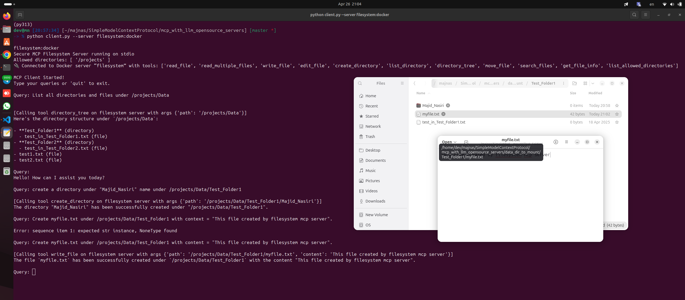

# pull filesystem docker image
```bash
docker pull mcp/filesystem
```

# to run the client with filesystem server
```bash
python client.py --server filesystem:docker
```


# terminal 
```bash
>> % python client.py --server filesystem:docker

filesystem:docker
Secure MCP Filesystem Server running on stdio
Allowed directories: [ '/projects' ]
🔌 Connected to Docker server “filesystem” with tools: ['read_file', 'read_multiple_files', 'write_file', 'edit_file', 'create_directory', 'list_directory', 'directory_tree', 'move_file', 'search_files', 'get_file_info', 'list_allowed_directories']

MCP Client Started!
Type your queries or 'quit' to exit.

Query: List all directories and files under /projects/Data


[Calling tool directory_tree on filesystem server with args {'path': '/projects/Data'}]
Here's the directory structure under `/projects/Data`:

- **Test_Folder1** (directory)
  - test_in_Test_Folder1.txt (file)
- **Test_Folder2** (directory)
  - test_in_Test_Folder2.txt (file)
- test1.txt (file)
- test2.txt (file)

Query: 
Hello! How can I assist you today?

Query: create a directory under "Majid_Nasiri" name under /projects/Data/Test_Folder1

[Calling tool create_directory on filesystem server with args {'path': '/projects/Data/Test_Folder1/Majid_Nasiri'}]
The directory "Majid_Nasiri" has been successfully created under "/projects/Data/Test_Folder1".

Query: Create myfile.txt under /projects/Data/Test_Folder1 with context = "This file created by filesystem mcp server".

Error: sequence item 1: expected str instance, NoneType found

Query: Create myfile.txt under /projects/Data/Test_Folder1 with content = "This file created by filesystem mcp server".

[Calling tool write_file on filesystem server with args {'path': '/projects/Data/Test_Folder1/myfile.txt', 'content': 'This file created by filesystem mcp server'}]
The file `myfile.txt` has been successfully created under `/projects/Data/Test_Folder1` with the content "This file created by filesystem mcp server".
```

# terminal screenshot
# Path Finding
<div align="center">
  <kbd style="width: 2px"></kbd>
</div>
