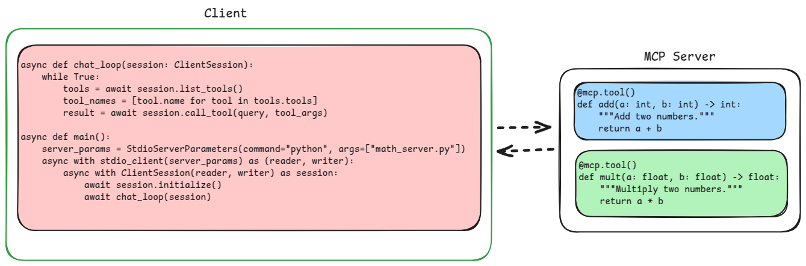

# Simple Math Client and Server Example ➕➖

<div align="center">
  <kbd style="width: 2px"></kbd>
</div>


This repository contains a simple example demonstrating the use of the `mcp` library for creating a client-server application where the client can call mathematical functions exposed by the server. 🚀

## Overview 👀

The example consists of three Python scripts:

-   **`math_server.py`**: This script defines a simple MCP (Message Channel Protocol) server that exposes two mathematical tools: `add` (for adding two integers) and `mult` (for multiplying two floats). ⚙️ This server is launched by the client scripts.
-   **`client_single_run.py`**: This script demonstrates how to connect to a server (launched internally) and call specific tools programmatically in a single run. ▶️ **Users can execute this script to see a single interaction with the server.**
-   **`client.py`**: This script provides an interactive command-line interface for connecting to a server (launched internally) and calling available tools by name, with the ability to input arguments in JSON format. 💬 **Users can execute this script for an interactive session with the server.**

## Prerequisites ✅

-   Python 3.6 or higher
-   The `mcp` library. You can install it using pip:
    ```bash
    pip install mcp
    ```

## Running the Example 🏃‍♂️

1.  **Run a Client:**
    Open a terminal and navigate to the directory containing the scripts. Run either the single-run client or the interactive client:
    -   **Single-Run Client:**
        ```bash
        python client_single_run.py
        ```
        This client will launch the server, connect, perform predefined actions, and then exit.
    -   **Interactive Client:**
        ```bash
        python client.py
        ```
        This client will launch the server and start an interactive command-line interface.

## Script Details 📜

### `math_server.py`

-   Imports the `FastMCP` class from the `mcp.server.fastmcp` module.
-   Creates an instance of `FastMCP` named `mcp`.
-   Defines two tools, `add` and `mult`, using the `@mcp.tool()` decorator.
    -   `add` takes two integer arguments (`a` and `b`) and returns their sum.
    -   `mult` takes two float arguments (`a` and `b`) and returns their product.
-   Runs the MCP server using `mcp.run()` when the script is executed directly (though in this example, it's launched by the clients).

### `client_single_run.py`

-   Imports necessary modules from `mcp.client`.
-   Defines an asynchronous `main` function.
-   Sets up `StdioServerParameters` to specify how to launch the server (using `python math_server.py`).
-   Uses `stdio_client` as an asynchronous context manager to launch the server and establish a connection to it using standard input/output streams.
-   Creates a `ClientSession` within the connection context.
-   Initializes the session to perform a handshake with the server.
-   Optionally lists the available tools using `session.list_tools()`.
-   Calls the `add` and `mult` tools using `session.call_tool()` with the required arguments.
-   Prints the results of the tool calls.
-   Runs the `main` function using `asyncio.run()`.

### `client.py`

-   Imports necessary modules from `mcp.client` and the `json` library.
-   Defines an asynchronous `chat_loop` function that provides the interactive command-line interface.
    -   Prompts the user to enter a tool name or `quit`.
    -   Lists available tools.
    -   If a valid tool name is entered, prompts for arguments in JSON format.
    -   Parses the JSON arguments and calls the specified tool using `session.call_tool()`.
    -   Prints the result or an error message if the JSON is invalid or the tool is unknown.
-   Defines an asynchronous `main` function similar to `client_single_run.py` to launch the server and establish a connection, then calls the `chat_loop`.
-   Runs the `main` function using `asyncio.run()`.
